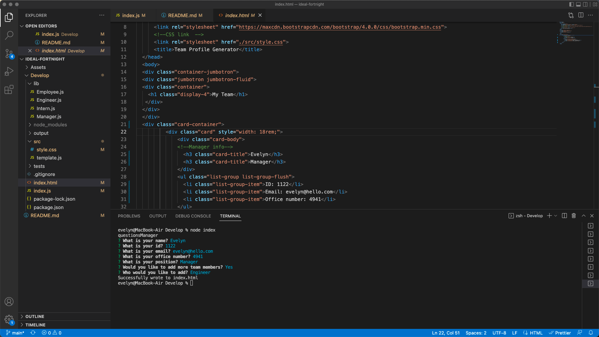

[](https://opensource.org/licenses/MIT)

# Object-Oriented Programming - Team Profile Generator

## Description

The goal of this assignment is to build a Node.js command-line application that takes in information about employees on a software engineering team, then generates an HTML webpage that displays summaries for each person. Also write a unit test for every part of the code and ensure that it passes each test.
For the application I use [Jest](https://www.npmjs.com/package/jest) for running the unit tests and [Inquirer](https://www.npmjs.com/package/inquirer) for collecting input from the user. The application will be invoked by using the following command:

```bash
node index.js
```

## Screenshots of the application

The following image shows a mock-up of the generated HTML’s appearance and functionality and some examples of the code.





### Walkthrough Video:

Clicking [this link](https://loom.com/share/61a346a42f814eeb93a88da43090677e) you will find the video.


